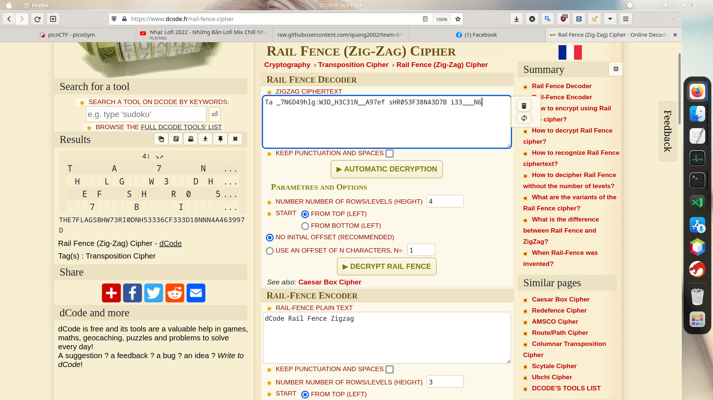

Bài đã cho chúng ta gợi ý ở ngay những giây phút đầu tiên. đó là mã hóa rail fence và 4 rails 

Đơn giản ta chỉ cần dùng tool online cop đoạn text vào và chọn số heigh là 4 

bùm và ta đã có flag : picoCTF{THE7FLAGSBHW73RI0DNH53336CF333D18NNN4A463997D}
