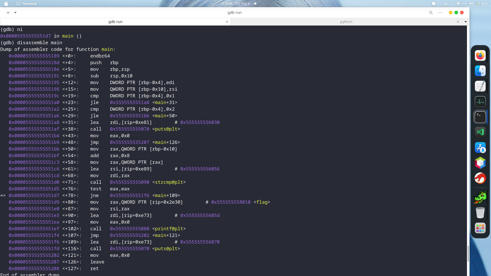
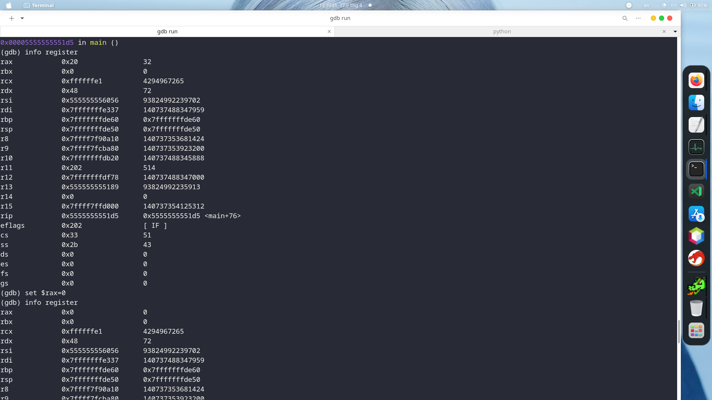
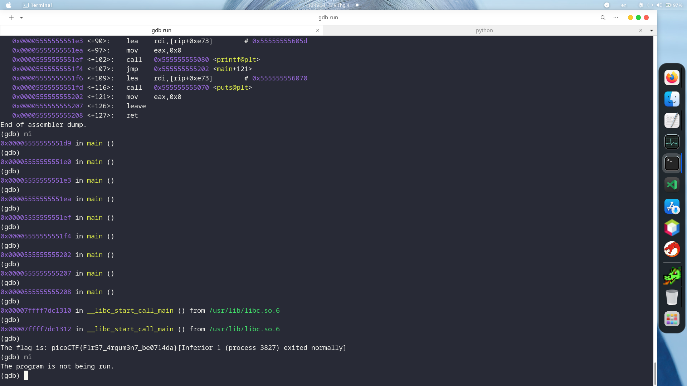

Đây là 1 bài tập tìm flag trong file thực thi flag. Bài này bn có thể dùng IDA, Ghidra để decompile code và phân tích tĩnh, từ đó get được flag. Tuy nhiên cách này chỉ để get được flag ko bị mã hóa. còn các flag bị mã hóa trong 1 file khác thì khá là khó khăn khi phân tích tĩnh. Hôm nay mk sẽ nói rõ hơn về kĩ thuật sử dụng gdb để debugger động.

Cách tư duy khi động đến những dạng bài như này là ta sẽ hình dung sơ đồ của program bằng cách gói các khối lệnh assembly lại thành các block và cố gắng kiểm soát luồng thực thi của chương trình bằng cách set các giá trị của thanh ghi.



ở đây tôi bắt đầu với việc sử dụng câu lệnh gdb ./run để khơi động debugger với gdb 
và bộ câu lệnh sau đây để setup view (Diễn đạt hơi chuối. Mong các bn thông cảm):

```Bash 
set disassembly-flavor intel //(vì tôi thích intel hơn AT&T)
disassemble main (có 1 số file phải dùng _start) //tháo gỡ hàm main 
```
ở đây các bn có thể thấy cấu trúc của hàm main

Những dòng push, sub để khởi tạo chương trình (Hoạt động như stack) 
 ```Bash
   0x000055555555519c <+19>:	cmp    DWORD PTR [rbp-0x4],0x1
   0x00005555555551a0 <+23>:	jle    0x5555555551a8 <main+31>
   0x00005555555551a2 <+25>:	cmp    DWORD PTR [rbp-0x4],0x2
   0x00005555555551a6 <+29>:	jle    0x5555555551bb <main+50>
```
mục đích của khối lệnh này là để check đầu và (rõ hơn là check số parameter) và chỉ chấp nhận đầu vào là 1 parameter Và nếu đầu vào hợp lệ nó sẽ nhảy đến vị trí <main+50> vậy ta chỉ cần nhập b đúng 1 parameter input là có thể pass qua khối lệnh này 

tiếp đó ta nhìn sang khối từ <main+50> 
```Bash
   0x00005555555551bb <+50>:	mov    rax,QWORD PTR [rbp-0x10]
   0x00005555555551bf <+54>:	add    rax,0x8
   0x00005555555551c3 <+58>:	mov    rax,QWORD PTR [rax]
   0x00005555555551c6 <+61>:	lea    rsi,[rip+0xe89]        # 0x555555556056
   0x00005555555551cd <+68>:	mov    rdi,rax
   0x00005555555551d0 <+71>:	call   0x555555555090 <strcmp@plt>
   0x00005555555551d5 <+76>:	test   eax,eax
   0x00005555555551d7 <+78>:	jne    0x5555555551f6 <main+109>
```
ta có thể nhận ra ngay được hàm strcmp mục đích của nó có thể là so sánh input với pwd để nếu đúng sẽ trả về flag 

ta lại nhìn nhanh xuống khối lệnh tiếp theo 

```Bash 
   
   0x00005555555551d9 <+80>:	mov    rax,QWORD PTR [rip+0x2e30]          # 		  0x555555558010 <flag>
   0x00005555555551e0 <+87>:	mov    rsi,rax
   0x00005555555551e3 <+90>:	lea    rdi,[rip+0xe73]        # 0x55555555605d
   0x00005555555551ea <+97>:	mov    eax,0x0
   0x00005555555551ef <+102>:	call   0x555555555080 <printf@plt>
```
Wow đến đây chắc các bn cũng thấy được đán rồi chứ , khối lệnh này để in ra được flag 
nhiệm vụ của chúng ta chỉ cần pass qua được câu lệnh test eax,eax của khối lệnh thì lệnh jne sẽ không đựợc thực thi trên:
```Bash 
   0x00005555555551bb <+50>:	mov    rax,QWORD PTR [rbp-0x10]
   0x00005555555551bf <+54>:	add    rax,0x8
   0x00005555555551c3 <+58>:	mov    rax,QWORD PTR [rax]
   0x00005555555551c6 <+61>:	lea    rsi,[rip+0xe89]        # 0x555555556056
   0x00005555555551cd <+68>:	mov    rdi,rax
   0x00005555555551d0 <+71>:	call   0x555555555090 <strcmp@plt>
   0x00005555555551d5 <+76>:	test   eax,eax
   0x00005555555551d7 <+78>:	jne    0x5555555551f6 <main+109>
```

và chúng ta sẽ xử lý cái test eax,eax bằng cách xét cho rax=0, trong ảnh giá trị của rax là 32 
và đây là các bước mk lm với các câu lệnh ni<chạy chương trình step-by-step>, info<xem giá trị của các thanh ghi>, set<xét giá trị cho các thanh ghi>



Và kết quả 




