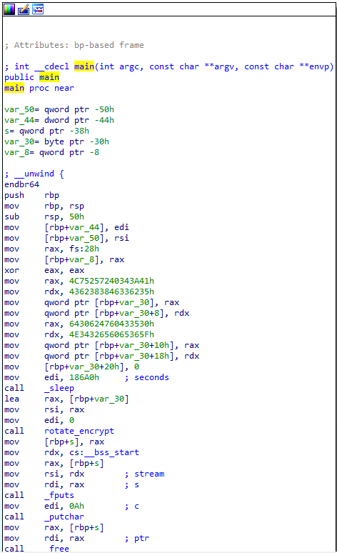
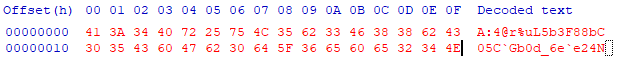
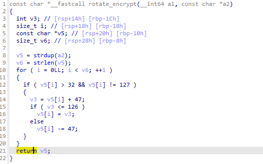

# [Reverse Engineering] GDB Test Drive

Bài này mục đích là muốn chúng ta thực hiện debug bằng gdb, nhưng cũng vì lí do mình không có môi trường để thực thi nên sẽ reverse qua IDA



Ở đây mình thấy có một mớ:

```x86asm
mov     rax, 4C75257240343A41h
mov     rdx, 4362383846336235h
mov     qword ptr [rbp+var_30], rax
mov     qword ptr [rbp+var_30+8], rdx
mov     rax, 6430624760433530h
mov     rdx, 4E3432656065365Fh
mov     qword ptr [rbp+var_30+10h], rax
mov     qword ptr [rbp+var_30+18h], rdx
mov     [rbp+var_30+20h], 0
```

Mình thấy đoạn code này để ghi 33 bytes (bao gồm cả byte 0 ở dòng cuối) tại var_30.

Vậy nên data ở var_30 sẽ phải có dạng:



> Lưu ý: Khi tính toán giá trị tại var_30, bằng các giá trị trên thì chúng ta phải đảo byte lại, lí do liên quan tới [Endianness](https://en.wikipedia.org/wiki/Endianness)

Nhìn vào string của hình trên ta thấy dù tất cả đều là printable character nhưng vẫn không theo format của flag, nên tiếp tục đọc xuống phía dưới, chúng ta sẽ thấy 

```x86asm
call rotate_encrypt
```

Vậy có thể phán đoán string ```A:4@r%uL5b3F88bC05C`Gb0d_6e`e24N``` chính là flag sau khi bị mã hóa, và để giải mã thì ta sẽ dùng hàm rotate_encrypt. Mà vì không thể debug nên mình sẽ code lại hàm này trong 1 ngôn ngữ nào đó (ở đây mình dùng C), thay vì mất thời gian đọc code asm, thì IDA PRO cung cấp tính năng **convert ASM sang C**. Thao tác thực hiện là chọn function muốn convert và bấm F5

Chúng ta được kết quả là: 



Hàm này có một vài thứ vô dụng nên mình sẽ viết lại thành:

```C
const char*  rotate_encrypt(const char* a2)
{
	char* flag = strdup(a2);
	for (int i = 0; a2[i] != '\0'; ++i)
	{
		if (flag[i] > 32 && flag[i] != 127)
		{
			int c = flag[i] + 47;
			if (c <= 126)
				flag[i] = c;
			else
				flag[i] -= 47;
		}
	}
	return flag;
}
```

Giờ thì ở hàm main mình sẽ viết như sau:
```C
int main() {
	printf(rotate_encrypt("A:4@r%uL5b3F88bC05C`Gb0d_6e`e24N"));
	return 0;
}
```

Kết quả:
> FLAG: picoCTF{d3bugg3r_dr1v3_50e616ac}

[Previous](file-run2.md)  
[Next](patchme.py.md)