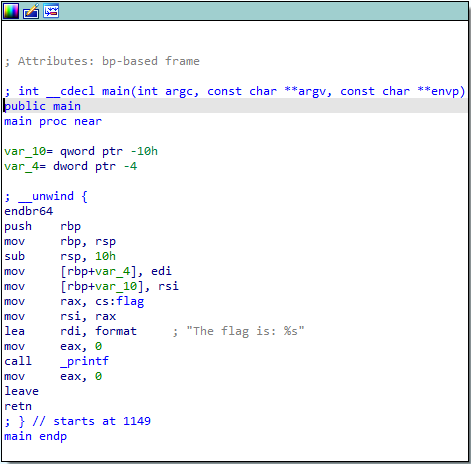
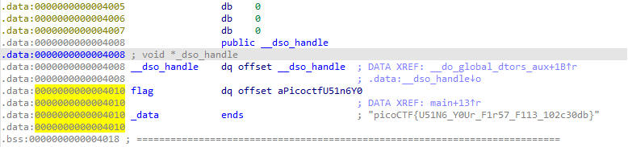

# [Reverse Engineering] file-run1

Bài này sẽ cho chúng ta một file run, và mình open nó với IDA, chúng ta được hàm main:



Ở đây chúng ta thấy string: **"The flag is: %s"**, trước đó còn có:

```x86asm
mov rax, cs:flag
```

và sau thì có call printf vậy nên biết được những dòng này để in flag ra, flag thì chúng ta thấy ngay được trong hình rồi, giờ thì click đúp vào để jump tới địa chỉ của flag, và flag của chúng ta là:



> FLAG: picoCTF{U51N6_Y0Ur_F1r57_F113_102c30db}

[Next](file-run2.md)