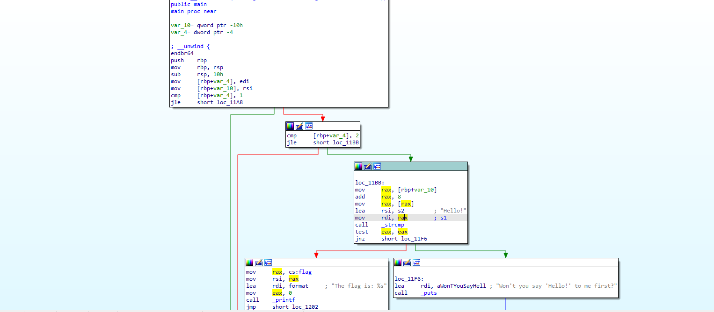
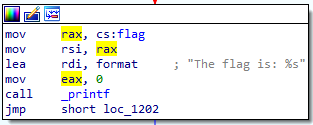
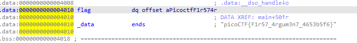

# [Reverse Engineering] file-run2

Bài này tương tự với bài [FILE-RUN1](file-run1.md), nhưng lần này hàm main có chút phức tạp hơn:

Theo như tên của đề bài thì muốn chúng ta truyền param trong lúc run file này, nhưng vì mình dùng windows và ko có môi trường để thực thi file nên chúng ta sẽ lấy flag qua IDA. 

Tương tự như bài trước, chúng ta thấy có một đoạn như sau:

Click đúp vào flag là xong!

> FLAG: picoCTF{F1r57_4rgum3n7_4653b5f6}

[Previous](file-run1.md)  
[Next](GDB%20Test%20Drive.md)